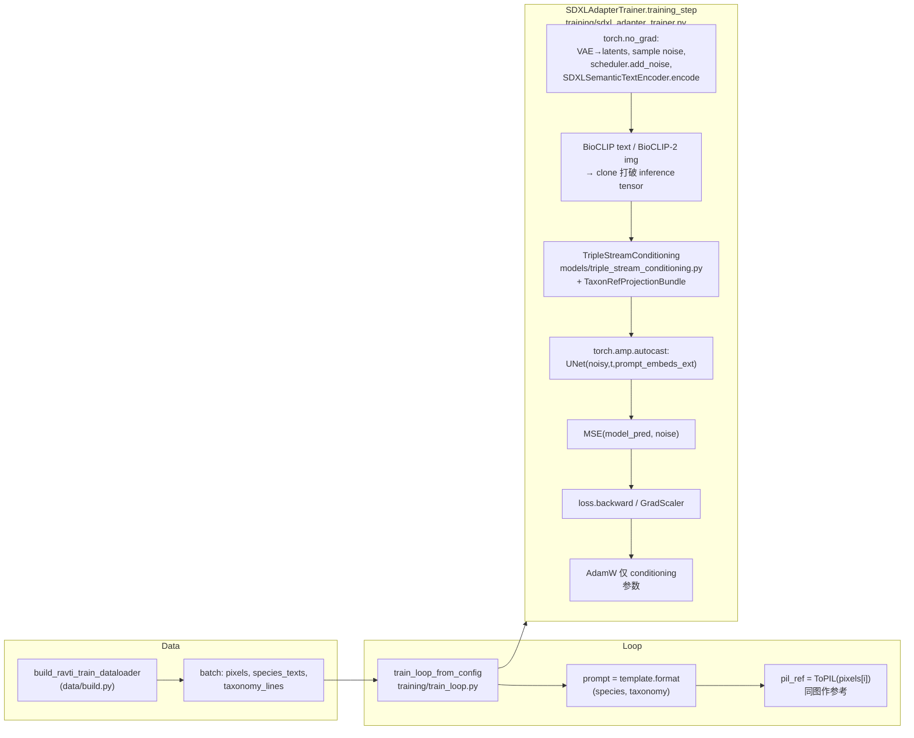

# RAVTI 研究代码库说明

**RAVTI**（Reliability-Aware Visual-Taxonomic Injection）是在 Stable Diffusion XL 上叠加「语义 + 分类学文本 + 检索图像」三流条件的研究脚手架，与课程/论文计划中的 **TaxaAdapter** 类工作形成对照（TaxaAdapter 官方代码未公开时，本仓库用于打通你自己的实验闭环）。

---

## 一、目录结构与各模块职责


| 路径                                | 存放内容                                                                                                                                                                                                                                             |
| --------------------------------- | ------------------------------------------------------------------------------------------------------------------------------------------------------------------------------------------------------------------------------------------------ |
| `**configs/`**                    | 实验 YAML 配置：模型 Hub ID、数据流式源、训练超参、检索与 sweep、基线/消融开关等。入口建议按数据集拆分（`inaturalist.yaml` / `fishnet.yaml`）。                                                                                                                                                                         |
| `**src/ravti/**`                  | Python 包根：`__init__.py`、`paths.py`（仓库根解析）、`config.py`（加载/合并 YAML、解析 `data/` 等路径）。                                                                                                                                                                |
| `**src/ravti/encoders/**`         | 多模态编码器：**SDXL 双文本塔**（语义/风格）、**BioCLIP 文本**（分类学字符串）、**BioCLIP-2 图像**（参考图形态）。均为「推理封装 + 冻结权重」为主。                                                                                                                                                    |
| `**src/ravti/retrieval/`**        | **Bio-Retrieval**：FAISS 向量索引（`faiss_index.py`）、物种查询 + top‑k 命中（`bio_retrieval.py`）。                                                                                                                                                              |
| `**src/ravti/models/`**           | **可训练/可替换**部分：`projections.py`（BioCLIP/BioCLIP-2 → SDXL 2048 维线性投影）、`triple_stream_conditioning.py`（在 `prompt_embeds` 序列末尾拼接 taxonomy/reference token）、`reliability.py`（由 CMC 得到 \lambda 的简化映射）、`decoupled_attention.py`（UNet 解耦交叉注意力实现）。 |
| `**src/ravti/data/`**             | 数据层：**统一入口** `build.py`（优先 `train_manifest_jsonl`，否则 `dataset.provider` → `DataLoader`）、**`providers/`**（`manifest.py` / `inaturalist.py` / `fishnet.py` / `treeoflife.py`）。 |
| `**src/ravti/training/`**         | **训练流水线**：`SDXLAdapterTrainer`（单步损失）、`train_loop.py`（按 YAML 多步遍历 `DataLoader`）、入口脚本 `scripts/train_ravti.py`。                                                                                                                                        |
| `**src/ravti/eval/`**             | **评估**：CAS@1 占位（接入你自己的 iNat21 上 ResNet 等分类器权重）、语义指标（BERTScore；多 LLM 描述对比可在此扩展）。                                                                                                                                                                  |
| `**src/ravti/experiments/`**      | **实验驱动**：`smoke.py` 分阶段冒烟（数据 → 元数据 → 检索 → 可选 SDXL 一步训练 → 评估）。                                                                                                                                                                                    |
| `**scripts/`**                    | 命令行入口：`train_ravti.py`、`build_retrieval_index.py`（由 manifest 建 FAISS）、`run_sweep.py`（CMC × k 网格 JSON）。                                                                                                                                           |
| `**data/**`（运行时生成，见 `.gitignore`） | **本地缓存**：`cache/`（HF 等缓存可指向此处）、`indices/`（`.faiss` + `.jsonl` 元数据）、`metadata/`（`ravti.sqlite` 等）。勿把超大原始数据集提交进 Git。                                                                                                                               |
| `**outputs/`**（建议自用）              | 训练日志、checkpoint、sweep 结果表等（可按需在配置里指向）。                                                                                                                                                                                                           |


---

## 二、完整实验流程（从环境到基线/消融）

以下为推荐顺序；若某步已满足可跳过。

### 步骤 1：配置 Conda 环境与 Python 包

1. 使用你已有的环境（例如）：
  ```powershell
   conda activate xxx
  ```
2. 进入仓库根目录并**以可编辑方式安装**本包（便于改代码即生效）：
  ```powershell
   cd e:\ExtraProgramming\599FinalResearch
   pip install -e .
  ```
3. 安装/确认本课题常用依赖（若尚未安装）：
  ```powershell
   pip install diffusers accelerate open_clip_torch faiss-cpu pyyaml
  ```
4. **Pillow 版本**：`datasets` 对流式图像解码需要较新的 Pillow。若出现 `PIL.Image.ExifTags` 相关错误，建议：
  ```powershell
   pip install "pillow>=10.2,<11"
  ```
5. **GPU**：SDXL 训练/推理强烈建议使用 CUDA；CPU 仅适合跑数据与检索等小步骤。
6. **Hugging Face**：下载模型与部分数据集需要网络；受限仓库可设置 `HF_TOKEN` 环境变量。

---

### 步骤 2：下载预训练模型（权重）

权重多数在**首次运行**时由 Hugging Face Hub **自动缓存**到本机（默认在用户级 HF cache 目录），无需手动逐个 wget。


| 组件                | 配置键 / 来源                                                                                   | 说明                                        |
| ----------------- | ------------------------------------------------------------------------------------------ | ----------------------------------------- |
| **SDXL Base**     | `configs/inaturalist.yaml`（或 `configs/fishnet.yaml`）→ `models.sdxl_model_id`：`stabilityai/stable-diffusion-xl-base-1.0` | 体积大，首次 `from_pretrained` 会长时间下载；需足够磁盘与显存。 |
| **BioCLIP 文本**    | `models.bioclip_text_hub`：`hf-hub:imageomics/bioclip-vit-b-16-inat-only`                   | 通过 `open_clip` 拉取。                        |
| **BioCLIP-2 图像**  | `models.bioclip2_image_hub`：`hf-hub:imageomics/bioclip-2`                                  | 同上；作参考图视觉流。                               |
| **BERTScore（可选）** | 语义指标首次调用时可能拉 RoBERTa 等                                                                     | 需联网一次。                                    |


**CAS@1 专用分类器**：在配置中设置 `evaluation.cas_classifier` 指向你本地的 **iNat21 上训练的 ResNet-50（或同类）** checkpoint；当前未填时 CAS 为占位实现（不反映真实精度）。

---

### 步骤 3：准备数据集（统一接口 `dataset.provider`）

训练与冒烟脚本均通过 `ravti.data.build.build_ravti_train_dataloader(cfg)` 取数，由配置中的 **`dataset.provider`** 选择后端（`configs/inaturalist.yaml` 默认 `inaturalist_mini`，`configs/fishnet.yaml` 默认 `fishnet`）。

| `provider` 取值 | 实现与典型用途 | 你需要准备的内容 |
| ---------------- | -------------- | ---------------- |
| **`inaturalist_mini`**（默认） | `src/ravti/data/providers/inaturalist.py`：封装 `torchvision.datasets.INaturalist`，`version: 2021_train_mini` | 在 `dataset.inaturalist.root` 下首次运行会按官方链接**下载并解压** mini 训练包（体积大、耗时长，请预留磁盘与带宽）。图像位于 `<root>/<version>/` 各物种文件夹内。物种名由文件夹名解析为「属 种」与一条 `>` 连接的阶元串，供 BioCLIP 文本条件使用。 |
| **`fishnet`** | `src/ravti/data/providers/fishnet.py`：`layout: imagefolder` 时为 `ImageFolder`（每类一个子文件夹）；`layout: manifest_csv` 时读 CSV | 将 FishNet 解压到本地，**推荐** `imagefolder`：根目录下每个子文件夹名对应物种（可用 `_` 代替空格）。若用 CSV，需列 `image_path`（相对 `root` 或绝对路径）与 `species`，可选 `taxonomy_column`。 |
| **`treeoflife_10m`** | `src/ravti/data/providers/treeoflife.py`：HF `datasets` **流式**读取 `dataset.treeoflife.hf_repo`（默认 `imageomics/TreeOfLife-10M`） | 数据量极大，仅建议在具备网络与配额的环境做**小规模试跑**；字段名因版本而异，可在 YAML 中调 `image_keys` / `text_keys`；若 Hub 要求 `trust_remote_code`，将 `dataset.treeoflife.trust_remote_code` 设为 `true`。 |

**通用 DataLoader 配置**（`dataset.dataloader`）：`batch_size`、`num_workers`、`shuffle`、`pin_memory`。流式 ToL 数据集会**强制** `shuffle=false` 且 `num_workers=0`，避免多进程与 Iterable 语义冲突。

**图像尺寸**：`training.image_size`（默认 512）控制 Resize，与 SDXL 训练输入一致。

**离线/CI（不下载真实数据）**：设置环境变量 **`RAVTI_SYNTHETIC_DATA=1`** 时，`build_ravti_dataset` 返回小型合成 `Dataset`，便于在无网环境验证导入与训练循环。可调 `dataset.synthetic.num_samples`。

---

### 步骤 4：元数据与检索索引（Bio-Retrieval）

1. **FAISS 索引**
  - 准备 JSONL manifest，每行至少包含：`{"species": "...", "image_path": "..."}`（`image_path` 可用于后续扩展为图像向量索引；当前示例索引脚本以 **物种名的 BioCLIP 文本向量** 为主）。  
  - 构建命令示例：
    ```powershell
    python scripts\build_retrieval_index.py --manifest data\metadata\gallery.jsonl --name species_index
    ```
  - 产物默认在 `data/indices/<name>.faiss` 与同前缀 `.jsonl`。
2. **检索参数**：`retrieval.k_default` 与消融中的 **k-sweep** 在配置 `sweeps.k_values` 与脚本 `scripts/run_sweep.py` 中体现。

---

### 步骤 5：打通训练 Pipeline

1. **检查配置**：编辑 `configs/inaturalist.yaml` 或 `configs/fishnet.yaml`（`dataset.provider`、`dataset.inaturalist` / `fishnet` / `treeoflife`、`training.max_train_steps`、`training.save_every_steps`、`training.output_dir`、`training.image_size`、`training.prompt_template`、学习率与混合精度、`lambda_*` 等）。
2. **快速验证（不拉 SDXL 大权重）**：
  ```powershell
   python -m ravti.experiments.smoke --stage all --skip-train
  ```
   将依次覆盖：**从当前 `provider` 取一个 batch** → **SQLite** → **演示 FAISS 检索** → **评估占位**。
3. **含 SDXL 的单步反传冒烟**（会下载 SDXL，需 GPU；**第一步 batch 来自真实 `DataLoader`**）：
  ```powershell
   python -m ravti.experiments.smoke --stage train
  ```
   或等价地：
  ```powershell
   python scripts\train_ravti.py --smoke-step
  ```
4. **正式多步训练**（按 `training.max_train_steps` 遍历 `DataLoader`，每个样本一步优化；参考图当前为**同一张训练图**的 PIL，便于先跑通；后续可接检索 top‑k）：
  ```powershell
   python scripts\train_ravti.py
  ```
   若 `max_train_steps` 大于**一个 epoch** 的步数，对 **Map 型**数据集（iNat / FishNet ImageFolder）会自动进入下一轮 epoch；对 **流式 TreeOfLife** 仅跑一遍流（耗尽即停）。
   训练中会按 `training.save_every_steps`（默认 **10**）写出中间权重：`use_reference_condition: false` 时为 `taxaAdapter_000010.pt` 形式，为 `true` 时为 `ravti_000010.pt`；若最后一步未落在该间隔上，会再存一个尾步 checkpoint。同一 run 时间戳下，**在这些已落盘的 checkpoint 里按当时记录的 loss 选最优**，将对应文件复制为 `taxaAdapter_best_<时间戳>.pt` / `ravti_best_<时间戳>.pt`（不在每一步做快照）。loss 曲线 CSV/PNG 仅在这些保存点上取数（`taxaAdapter_loss_<时间戳>.csv/.png` 等；无 matplotlib 则仅 CSV）。另有 `train_log_<时间戳>.txt`。

**设计说明（与论文计划对齐）**：当前统一使用 **projection + decoupled cross-attention**。`training.use_reference_condition` 是唯一结构开关：为 `true` 时注入 taxonomy + reference 两路条件；为 `false` 时只注入 taxonomy 条件（等价于 TaxaAdapter 风格基线）。Checkpoint / W&B 等可在 `train_loop_from_config` 上自行加钩子。

---

### 步骤 6：评估性能

1. **CAS@1 / CAS@5**
  - 训练或推理得到生成图后，用你在 iNat21（或 FishNet）上训好的分类器做 top-1 / top-5 物种命中率。  
  - 将模型权重路径写入 `evaluation.cas_classifier`；加载与打分逻辑见 `src/ravti/eval/classification_accuracy.py`。
2. **T2I 对齐（TaxaAdapter 风格）**
  - `src/ravti/eval/t2i_alignment.py`：**CLIP** 为生成图 vs **物种俗名**；**BioCLIP** 为生成图 vs **分类学名称串**（`taxonomy_line`）。
3. **图像质量（预留）**
  - `src/ravti/eval/image_quality.py` 中为 **FID / LPIPS** 占位接口，后续可接入实现。

---

### 步骤 7：基线（B1 / B2）

在 `configs/inaturalist.yaml` / `configs/fishnet.yaml` 的 `**baselines`** 段已用开关语义描述：


| 基线                    | 含义                                      | 在代码中的落地方式（需你在训练/推理分支中读取配置）                                  |
| --------------------- | --------------------------------------- | ----------------------------------------------------------- |
| **B1：SDXL Zero-Shot** | 仅自然语言 prompt，无分类学文本、无检索参考               | `use_taxonomy: false`, `use_retrieval: false`               |
| **B2：TaxaAdapter 风格** | 有分类学文本流，但 **\lambda_{ref}=0**（无 RAG 视觉） | `use_taxonomy: true`, `use_retrieval: false`，并令 ref 分支权重为 0 |


建议为每个基线复制一份 YAML（如 `configs/baseline_b1.yaml`），仅覆盖 `experiment_name` 与 `baselines` 相关字段，便于复现实验矩阵。

---

### 步骤 8：消融实验

配置中 `**ablation`** 段对应计划书中的：

- **taxonomy_only**：仅分类学，关闭检索。  
- **rag_only**：仅检索视觉参考（实现时需明确 taxon 文本如何置空或屏蔽）。  
- **unified**：完整 RAVTI（taxonomy + RAG + 可靠性门控）。

落地方式：在训练/推理脚本中读取 `cfg["ablation"]` 或与命令行 `--mode taxonomy_only` 结合，控制是否调用 `BioRetriever`、是否传入 `taxon_string`、以及 `TripleStreamConditioning` 的 \lambda。

**CMC Cliff Sweep**：  

```powershell
python scripts\run_sweep.py --out outputs\sweep_matrix.json
```

生成 `cmc` 与 `k` 的笛卡尔积列表，供外层调度（如多 GPU 多作业）逐点重训或仅重推理。

---

## 三、常用命令速查

```powershell
conda activate ai_full
cd e:\ExtraProgramming\599FinalResearch
pip install -e .

# 全流程冒烟（跳过 SDXL 训练）
python -m ravti.experiments.smoke --stage all --skip-train

# 仅数据 / 仅检索 / 仅训练
python -m ravti.experiments.smoke --stage data
python -m ravti.experiments.smoke --stage retrieval
python -m ravti.experiments.smoke --stage train

# 正式训练（默认 provider：iNaturalist mini）
python scripts\train_ravti.py

# 仅单步反传（调试）
python scripts\train_ravti.py --smoke-step

# Sweep 表
python scripts\run_sweep.py
```

---

## 四、引用与致谢

- **SDXL**、**diffusers**、**BioCLIP / BioCLIP-2**（Imageomics）、**FAISS**、**open_clip** 等请分别按其官方要求引用。  
- 课题文字与实验设计以你仓库中的 `**class final research project.md`** 为准；本 README 描述的是当前**代码仓库实际目录与可运行步骤**，二者若有出入以你最终论文设定为准并同步改配置与脚本。

如有缺失的公开数据集（例如特定 FishNet 处理版本），可在 Hugging Face 或本地 `E:/Datasets/Image` 补齐后，通过 manifest + `build_retrieval_index.py` 接入检索与训练。

---

## 五、训练数据流与代码对照（含与 Proposal 的差异）

本节说明**当前仓库真实实现**：一个训练样本从 `DataLoader` 到 **loss** 再到 **反向传播** 的路径，并对照 `class final research project.md` 中的 **RAVTI Proposal**（三流解耦交叉注意）说明**一致点与刻意简化点**。阅读时可对照源码文件同名符号。

### 5.1 Proposal 与本实现的架构差异（为何「看起来不一样」）

| 维度 | Proposal（计划书 §1.4） | 当前代码（统一实现） |
|------|------------------------|---------------------|
| 条件注入位置 | 在 SDXL **UNet 内部**替换/扩展为 **Decoupled Cross-Attention**：\(Z=\mathrm{Attn}(Q,K_b,V_b)+\lambda_{tax}\mathrm{Attn}(Q,K_t,V_t)+\lambda_{ref}\mathrm{Attn}(Q,K_r,V_r)\)，\(Q\) 来自特征，\(K,V\) 来自三流投影 | **不改 UNet 内部 attention**：在送入 UNet 之前，把 SDXL 的 **`encoder_hidden_states`**（即 `prompt_embeds` 序列）**在序列维上拼接**两个由 BioCLIP/BioCLIP-2 经 **线性层** 映射得到的 token（见 `triple_stream_conditioning.py`）。UNet 仍是 diffusers 默认实现。 |
| 可训练参数 | 投影 + **tax/ref 两路的 \(W_k,W_v\)**（计划中 ~22M 的一部分） | **仅** `TaxonRefProjectionBundle` 中的 **`nn.Linear`**（`projections.py`）。**没有**在 UNet 里单独实现第三、四组 \(K,V\) 的注意力权重。 |
| 检索 RAG | 推理时用 FAISS 取 top‑\(k\) 参考图，BioCLIP-2 编码 | 训练循环里**尚未接入**检索：`train_loop.py` 中参考图 **`pil_ref` 当前等于本张训练图**（`_tensor_to_pil(pixels[i])`），用于先跑通梯度；检索与索引见 `retrieval/`、`scripts/build_retrieval_index.py`。 |
| \(\lambda\) 门控 | 训练中 Reliability-Aware 对 \(\lambda\) 的显式建模 | `reliability.py` 中 **CMC → \((\lambda_{tax},\lambda_{ref})\)** 的**标量规则**；`training_step` 用配置里的 `cmc_train_default`（见 `train_loop.py`）。 |

**结论**：语义上仍是「SDXL 语义流 + BioCLIP 分类学流 + BioCLIP-2 视觉流 + 标量 \(\lambda\)」，工程上已统一为 **条件序列拼接 + UNet 内解耦注意力**。通过 `use_reference_condition` 可切换到 taxonomy-only 版本，直接对应 TaxaAdapter 风格基线。

---

### 5.2 端到端数据流（单样本一步）

入口：**`scripts/train_ravti.py`** → **`ravti.training.train_loop.train_loop_from_config`**（多步）或 **`ravti.experiments.smoke.run_train_smoke`**（单步 smoke）。



**逐步说明（与代码一一对应）：**

1. **数据出队**  
   - **`ravti.data.build.build_ravti_train_dataloader`** 按 `dataset.provider` 构建 `DataLoader`，**`ravti_collate_fn`** 把样本拼成 `pixels`（`[B,3,H,W]`）、`species_texts`、`taxonomy_lines`。

2. **训练循环取一条样本**（`training/train_loop.py`）  
   - `pixels[i:i+1]` → 设备与 `dtype`（通常 fp16）。  
   - **`training.prompt_template`** 格式化为自然语言 **`prompt`**（语义流，给 SDXL 双塔）。  
   - **`taxon_string`** 使用 **`taxonomy_lines[i]`**（完整阶元串，给 BioCLIP 文本塔）。  
   - **`ref_images=[pil_ref]`**：当前为**同一张图**的 PIL，供 BioCLIP-2；后续可换成检索结果。

3. **`SDXLAdapterTrainer.training_step`**（`training/sdxl_adapter_trainer.py`）  
   - **`torch.no_grad()`** 内：  
     - **`pipe.vae.encode`** → 潜变量 × `scaling_factor`；  
     - 采样 **`noise`**，随机 **`timesteps`**，**`scheduler.add_noise`** 得 **`noisy`**；  
     - **`SDXLSemanticTextEncoder.encode`**（`encoders/semantic_sdxl.py`）→ **`sem.prompt_embeds`**、**`sem.pooled_prompt_embeds`**（冻结，无梯度）。  
   - **梯度路径起点**：**`BioCLIPTaxonEncoder`** / **`BioCLIP2VisualEncoder`** 在 `inference_mode` 下前向，输出经 **`.clone()`** 变为普通张量 **`tax` / `ref`**。  
   - **`TripleStreamConditioning.forward`**：  
     - **`TaxonRefProjectionBundle`**（`models/projections.py`）把 `tax`、`ref` 投到 SDXL 隐维（默认 2048），再乘 **`reliability_lambdas`** 得到的标量 **`lambda_tax` / `lambda_ref`**（`models/reliability.py`）；  
     - 与 **`sem.prompt_embeds`** **按序列维 `cat`**，得到扩展后的 **`encoder_hidden_states`**。  
   - **`torch.amp.autocast("cuda")`** 内：**`pipe.unet(noisy, timesteps, encoder_hidden_states=prompt_embeds, added_cond_kwargs={text_embeds, time_ids})`** → **`model_pred`**（UNet **冻结**，参与前向但**不参与** `optimizer` 更新）。  
   - **损失**：\(\mathcal{L} = \mathrm{MSE}(\texttt{model\_pred}, \texttt{noise})\)（代码里 **`F.mse_loss(model_pred.float(), target.float())`**，`target` 即 **`noise`**）。标准 **LDM 噪声预测**形式。

4. **反向传播与参数更新**  
   - **`optimizer` 仅包含 `self.conditioning.parameters()`**（初始化于 `SDXLAdapterTrainer.__init__`，即 **`TaxonRefProjectionBundle` 的 Linear 权重与偏置**）。  
   - **`loss.backward()`**（或 **`GradScaler`** 路径）时：梯度经 **UNet 对 `encoder_hidden_states` 的偏导** 回传到 **`prompt_embeds` 的拼接结果**；由于 **`sem.prompt_embeds`** 在 `no_grad` 中生成，**梯度只流入** 由 **`tax_tok` / `ref_tok`** 贡献的维度，进而更新 **`TaxonRefProjectionBundle`**。  
   - **`optimizer.step()`** 更新上述 Linear。**VAE、UNet、SDXL 文本塔、BioCLIP、BioCLIP-2** 均保持冻结。

---

### 5.3 与「可训练 ~22M 参数 / 解耦 \(W_k,W_v\)」的对照

Proposal 中 **Decoupled Attention 的 \(W_k,W_v\)** 对应 **UNet 内部**额外分支，本仓库当前版本已在 `models/decoupled_attention.py` 中落地实现；可训练参数由 projection 与 decoupled processor 共同组成。若关闭 `use_reference_condition`，则 reference 分支不参与条件注入，可直接作为 TaxaAdapter 风格对照。

---

### 5.4 关于 `loss = nan`（与数据流的关系）

在 **`mixed_precision: fp16`** 且 **UNet 整段处于 `autocast`** 时，**大 UNet 在 fp16 下前向**偶发数值溢出，会导致 **`model_pred` 含 NaN**，进而 **MSE 为 NaN**；这与「数据是否读对」无必然联系。若多步持续 NaN，可优先尝试：

- 将 **`training.mixed_precision`** 改为非 fp16（例如先关掉 scaler，使 **`self.scaler` 为 `None`**，整条 **`training_step`** 在更稳的精度下跑 UNet）；或  
- **降低 `training.learning_rate`**；或  
- 仅在 **投影与条件拼接** 用半精度、**UNet 前向强制 `float32`**（需改 `sdxl_adapter_trainer.py` 中 autocast 范围）。

这些属于**数值工程**，不改变 §5.2 所述的**数据流拓扑**。