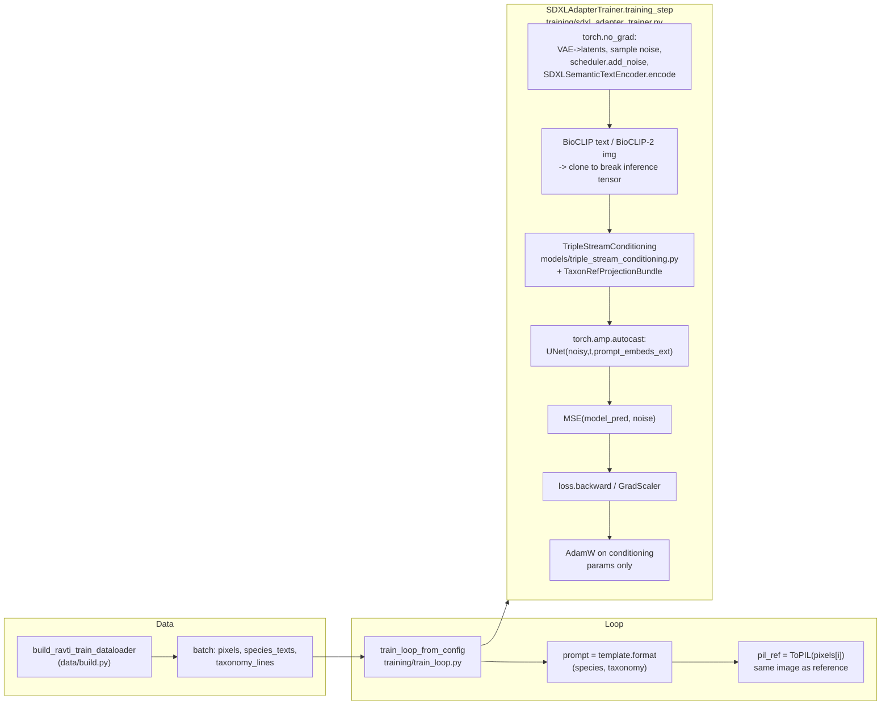

# RAVTI Research Codebase Documentation

**RAVTI** (Reliability-Aware Visual-Taxonomic Injection) is a research scaffold that adds "semantic + taxonomic text + retrieved image" triple-stream conditioning on top of Stable Diffusion XL. It serves as a counterpart to **TaxaAdapter**-style work from the course/paper plan (this repository is used to build your own experimental pipeline when TaxaAdapter's official code is not publicly available).

---

## 1. Directory Structure and Module Responsibilities


| Path                              | Contents                                                                                                                                                                                                                                         |
| --------------------------------- | ------------------------------------------------------------------------------------------------------------------------------------------------------------------------------------------------------------------------------------------------ |
| `**configs/`**                    | Experiment YAML configs: model Hub IDs, data streaming sources, training hyperparameters, retrieval and sweep settings, baseline/ablation toggles, etc. The main entry point is typically `default.yaml`.                                          |
| `**src/ravti/**`                  | Python package root: `__init__.py`, `paths.py` (repository root resolution), `config.py` (load/merge YAML, resolve `data/` paths, etc.).                                                                                                        |
| `**src/ravti/encoders/**`         | Multimodal encoders: **SDXL dual text towers** (semantic/style), **BioCLIP text** (taxonomic strings), **BioCLIP-2 image** (reference image morphology). Primarily "inference wrappers + frozen weights".                                          |
| `**src/ravti/retrieval/`**        | **Bio-Retrieval**: FAISS vector index (`faiss_index.py`), species query + top-k hits (`bio_retrieval.py`).                                                                                                                                       |
| `**src/ravti/models/`**           | **Trainable/swappable** components: `projections.py` (BioCLIP/BioCLIP-2 to SDXL 2048-dim linear projections), `triple_stream_conditioning.py` (appends taxonomy/reference tokens at the end of the `prompt_embeds` sequence), `reliability.py` (simplified mapping from CMC to lambda), `decoupled_attention.py` (UNet decoupled cross-attention implementation). |
| `**src/ravti/data/`**             | Data layer: **unified entry point** `build.py` (`dataset.provider` to `DataLoader`), **`providers/`** (`inaturalist.py` / `fishnet.py` / `treeoflife.py` — three backends), `metadata_store.py`, `streaming_datasets.py` (optional HF generic streaming wrapper). |
| `**src/ravti/training/`**         | **Training pipeline**: `SDXLAdapterTrainer` (single-step loss), `train_loop.py` (multi-step iteration over `DataLoader` per YAML config), entry script `scripts/train_ravti.py`.                                                                  |
| `**src/ravti/eval/`**             | **Evaluation**: CAS@1 placeholder (plug in your own iNat21 ResNet or similar classifier weights), semantic metrics (BERTScore; multi-LLM description comparison can be extended here).                                                             |
| `**src/ravti/experiments/`**      | **Experiment driver**: `smoke.py` runs staged smoke tests (data -> metadata -> retrieval -> optional single SDXL training step -> evaluation).                                                                                                    |
| `**scripts/`**                    | CLI entry points: `train_ravti.py`, `build_retrieval_index.py` (build FAISS from manifest), `run_sweep.py` (CMC x k grid JSON).                                                                                                                  |
| `**data/**` (generated at runtime, see `.gitignore`) | **Local cache**: `cache/` (HF cache can point here), `indices/` (`.faiss` + `.jsonl` metadata), `metadata/` (`ravti.sqlite`, etc.). Do not commit large raw datasets to Git.                                                                      |
| `**outputs/**` (recommended for personal use) | Training logs, checkpoints, sweep result tables, etc. (can be configured as needed).                                                                                                                                                              |


---

## 2. Full Experiment Workflow (From Environment Setup to Baselines/Ablations)

Follow the recommended order below; skip any step that is already satisfied.

### Step 1: Configure Conda Environment and Python Package

1. Activate your existing environment (for example):
  ```powershell
   conda activate xxx
  ```
2. Navigate to the repository root and **install the package in editable mode** (so code changes take effect immediately):
  ```powershell
   cd e:\ExtraProgramming\599FinalResearch
   pip install -e .
  ```
3. Install/verify commonly needed dependencies for this project (if not already installed):
  ```powershell
   pip install diffusers accelerate open_clip_torch faiss-cpu bert-score pyyaml
  ```
4. **Pillow version**: `datasets` requires a recent Pillow for streaming image decoding. If you encounter `PIL.Image.ExifTags`-related errors, try:
  ```powershell
   pip install "pillow>=10.2,<11"
  ```
5. **GPU**: SDXL training/inference strongly requires CUDA; CPU is only suitable for data and retrieval steps.
6. **Hugging Face**: Downloading models and some datasets requires internet access; for gated repositories, set the `HF_TOKEN` environment variable.

---

### Step 2: Download Pretrained Models (Weights)

Most weights are **automatically cached** locally by the Hugging Face Hub on **first run** (default location is the user-level HF cache directory) — no need to manually wget each one.


| Component           | Config Key / Source                                                                          | Notes                                                     |
| ------------------- | -------------------------------------------------------------------------------------------- | --------------------------------------------------------- |
| **SDXL Base**       | `configs/default.yaml` -> `models.sdxl_model_id`: `stabilityai/stable-diffusion-xl-base-1.0` | Large model; first `from_pretrained` call takes a long time to download; requires sufficient disk space and VRAM. |
| **BioCLIP Text**    | `models.bioclip_text_hub`: `hf-hub:imageomics/bioclip-vit-b-16-inat-only`                   | Fetched via `open_clip`.                                  |
| **BioCLIP-2 Image** | `models.bioclip2_image_hub`: `hf-hub:imageomics/bioclip-2`                                  | Same mechanism; used as the reference image visual stream. |
| **BERTScore (optional)** | May pull RoBERTa or similar on first call of the semantic metric                        | Requires internet once.                                   |


**CAS@1 Dedicated Classifier**: Set `evaluation.cas_classifier` in the config to point to your local **ResNet-50 (or similar) checkpoint trained on iNat21**; when left empty, CAS is a placeholder implementation (does not reflect real accuracy).

---

### Step 3: Prepare Datasets (Unified Interface `dataset.provider`)

Both training and smoke test scripts fetch data via `ravti.data.build.build_ravti_train_dataloader(cfg)`, which selects the backend based on **`dataset.provider`** in `configs/default.yaml` (**default: `inaturalist_mini`**).

| `provider` Value | Implementation and Typical Use | What You Need to Prepare |
| ---------------- | ------------------------------ | ------------------------ |
| **`inaturalist_mini`** (default) | `src/ravti/data/providers/inaturalist.py`: wraps `torchvision.datasets.INaturalist`, `version: 2021_train_mini` | On first run under `dataset.inaturalist.root`, the official mini training package will be **downloaded and extracted** (large size, takes time — ensure sufficient disk space and bandwidth). Images are located in `<root>/<version>/` species folders. Species names are parsed from folder names as "Genus species" and a `>` delimited rank string for BioCLIP text conditioning. |
| **`fishnet`** | `src/ravti/data/providers/fishnet.py`: `layout: imagefolder` uses `ImageFolder` (one subfolder per class); `layout: manifest_csv` reads a CSV | Extract FishNet locally. **Recommended**: `imagefolder` — each subfolder under the root directory corresponds to a species (can use `_` in place of spaces). For CSV, columns `image_path` (relative to `root` or absolute) and `species` are required; `taxonomy_column` is optional. |
| **`treeoflife_10m`** | `src/ravti/data/providers/treeoflife.py`: HF `datasets` **streaming** from `dataset.treeoflife.hf_repo` (default `imageomics/TreeOfLife-10M`) | Very large dataset — only recommended for **small-scale trial runs** in environments with network access and quota; field names vary by version and can be adjusted via `image_keys` / `text_keys` in YAML; if the Hub requires `trust_remote_code`, set `dataset.treeoflife.trust_remote_code` to `true`. |

**General DataLoader Config** (`dataset.dataloader`): `batch_size`, `num_workers`, `shuffle`, `pin_memory`. Streaming ToL datasets **force** `shuffle=false` and `num_workers=0` to avoid conflicts between multiprocessing and Iterable semantics.

**Image Size**: `training.image_size` (default 512) controls Resize and matches the SDXL training input resolution.

**Offline/CI (no real data download)**: Setting the environment variable **`RAVTI_SYNTHETIC_DATA=1`** causes `build_ravti_dataset` to return a small synthetic `Dataset`, useful for verifying imports and training loops without network access. Adjust `dataset.synthetic.num_samples` as needed.

**Optional**: `HfStreamingImageIterable` in `src/ravti/data/streaming_datasets.py` can still be used for **custom** Hugging Face dataset experiments, but is not the default training path.

---

### Step 4: Metadata and Retrieval Index (Bio-Retrieval)

1. **SQLite Metadata (optional but useful for O(1) lookups)**
  - The smoke test script creates a sample database at `data/metadata/ravti.sqlite`. For production experiments, call `MetadataStore.upsert_sample` in your data preparation scripts to write `external_id`, `species_name`, `taxonomy_json`, etc.
2. **FAISS Index**
  - Prepare a JSONL manifest where each line contains at minimum: `{"species": "...", "image_path": "..."}` (`image_path` can be used for future extension to image vector indexing; the current example indexing script primarily uses **BioCLIP text vectors of species names**).
  - Example build command:
    ```powershell
    python scripts\build_retrieval_index.py --manifest data\metadata\gallery.jsonl --name species_index
    ```
  - Output defaults to `data/indices/<name>.faiss` and a same-prefix `.jsonl`.
3. **Retrieval Parameters**: `retrieval.k_default` and the ablation **k-sweep** are configured in `sweeps.k_values` and the script `scripts/run_sweep.py`.

---

### Step 5: End-to-End Training Pipeline

1. **Review config**: Edit `configs/default.yaml` (`dataset.provider`, `dataset.inaturalist` / `fishnet` / `treeoflife`, `training.max_train_steps`, `training.save_every_steps`, `training.output_dir`, `training.image_size`, `training.prompt_template`, `training.cmc_train_default`, learning rate and mixed precision, `lambda_*`, etc.).
2. **Quick validation (without downloading SDXL weights)**:
  ```powershell
   python -m ravti.experiments.smoke --stage all --skip-train
  ```
   This sequentially covers: **fetch one batch from the current `provider`** -> **SQLite** -> **demo FAISS retrieval** -> **evaluation placeholder**.
3. **Single-step backprop smoke test with SDXL** (downloads SDXL, requires GPU; **the first batch comes from the real `DataLoader`**):
  ```powershell
   python -m ravti.experiments.smoke --stage train
  ```
   Or equivalently:
  ```powershell
   python scripts\train_ravti.py --smoke-step
  ```
4. **Full multi-step training** (iterates over the `DataLoader` for `training.max_train_steps` steps, one optimization step per sample; reference images are currently **the same training image** as PIL, for pipeline validation; can later be replaced with retrieval top-k):
  ```powershell
   python scripts\train_ravti.py
  ```
   If `max_train_steps` exceeds the number of steps in **one epoch**, **Map-style** datasets (iNat / FishNet ImageFolder) will automatically proceed to the next epoch; **streaming TreeOfLife** only runs through the stream once (stops when exhausted).
   During training, intermediate checkpoints are saved every `training.save_every_steps` (default **10**) steps, and a final `adapter_final.pt` is written to `training.output_dir` at completion. A timestamped log file (e.g., `train_log_202604130551.txt`) is also generated in the same directory, recording `step/loss/species` and other information at each checkpoint in Markdown table format, with key hyperparameters noted at the top of the file.

**Design Notes (aligned with the paper plan)**: The current implementation uniformly uses **projection + decoupled cross-attention**. `training.use_reference_condition` is the only structural toggle: when `true`, both taxonomy and reference conditioning streams are injected; when `false`, only taxonomy conditioning is injected (equivalent to a TaxaAdapter-style baseline). Checkpoint / W&B hooks can be added on top of `train_loop_from_config` as needed.

---

### Step 6: Evaluate Performance

1. **CAS@1**
  - After training or inference produces generated images, use a classifier trained on iNat21 (or FishNet) for top-1 species hit rate.
  - Set the model weights path in `evaluation.cas_classifier`, and replace the placeholder logic in `eval/cas_metric.py` with an actual `forward` pass.
2. **Multi-LLM Semantic Metrics (BioCAP-style)**
  - Pipeline: generate trait descriptions for "generated image vs. ground truth image" using **GPT-4o / InternVL** -> compare on the text side using **BERTScore** or sentence embedding cosine similarity.
  - `eval/semantic_metric.py` already implements the **BERTScore** path; LLM calls require you to integrate your own API and prompt, then pass both descriptions to `compare_from_llm_descriptions`.

---

### Step 7: Baselines (B1 / B2)

Baseline toggles are described in the `**baselines**` section of `configs/default.yaml`:


| Baseline              | Meaning                                             | Implementation in Code (requires reading config in your training/inference branch)       |
| --------------------- | --------------------------------------------------- | ---------------------------------------------------------------------------------------- |
| **B1: SDXL Zero-Shot** | Natural language prompt only, no taxonomic text, no retrieval reference | `use_taxonomy: false`, `use_retrieval: false`                                            |
| **B2: TaxaAdapter-style** | Has taxonomic text stream, but **lambda_ref=0** (no RAG visual) | `use_taxonomy: true`, `use_retrieval: false`, and set reference branch weight to 0        |


It is recommended to create a separate YAML for each baseline (e.g., `configs/baseline_b1.yaml`), overriding only `experiment_name` and baseline-related fields, to facilitate reproducible experiment matrices.

---

### Step 8: Ablation Experiments

The `**ablation**` section in the config corresponds to the items in the proposal:

- **taxonomy_only**: Taxonomy only, retrieval disabled.
- **rag_only**: Retrieval visual reference only (implementation must specify how to null out or mask the taxon text).
- **unified**: Full RAVTI (taxonomy + RAG + reliability gating).

Implementation: Read `cfg["ablation"]` in the training/inference scripts or combine with the CLI flag `--mode taxonomy_only` to control whether `BioRetriever` is invoked, whether `taxon_string` is passed, and the lambda values in `TripleStreamConditioning`.

**CMC Cliff Sweep**:

```powershell
python scripts\run_sweep.py --out outputs\sweep_matrix.json
```

Generates a Cartesian product list of `cmc` and `k` values, for outer-loop scheduling (e.g., multi-GPU multi-job) to retrain or re-infer at each point.

---

## 3. Quick Command Reference

```powershell
conda activate ai_full
cd e:\ExtraProgramming\599FinalResearch
pip install -e .

# Full-pipeline smoke test (skip SDXL training)
python -m ravti.experiments.smoke --stage all --skip-train

# Data only / Retrieval only / Training only
python -m ravti.experiments.smoke --stage data
python -m ravti.experiments.smoke --stage retrieval
python -m ravti.experiments.smoke --stage train

# Full training (default provider: iNaturalist mini)
python scripts\train_ravti.py

# Single-step backprop only (debugging)
python scripts\train_ravti.py --smoke-step

# Sweep table
python scripts\run_sweep.py
```

---

## 4. Citations and Acknowledgements

- **SDXL**, **diffusers**, **BioCLIP / BioCLIP-2** (Imageomics), **FAISS**, **open_clip**, etc. should each be cited according to their official requirements.
- The project write-up and experiment design follow your repository's `**class final research project.md**`; this README describes the **current codebase's actual directory and runnable steps**. If there are discrepancies, defer to your final paper and update configs/scripts accordingly.

If any public datasets are missing (e.g., a specific FishNet processed version), they can be obtained on Hugging Face or locally at `E:/Datasets/Image`, then integrated into retrieval and training via manifest + `build_retrieval_index.py`.

---

## 5. Training Data Flow and Code Walkthrough (Including Differences from the Proposal)

This section describes the **current repository's actual implementation**: the path of a training sample from `DataLoader` to **loss** to **backpropagation**, and compares it with the **RAVTI Proposal** (triple-stream decoupled cross-attention) from `class final research project.md`, highlighting **points of agreement and deliberate simplifications**. Cross-reference with identically named symbols in the source files while reading.

### 5.1 Architecture Differences Between Proposal and Implementation (Why It "Looks Different")

| Dimension | Proposal (Plan Section 1.4) | Current Code (Unified Implementation) |
|-----------|----------------------------|----------------------------------------|
| Conditioning injection point | Replace/extend SDXL **UNet internals** with **Decoupled Cross-Attention**: \(Z=\mathrm{Attn}(Q,K_b,V_b)+\lambda_{tax}\mathrm{Attn}(Q,K_t,V_t)+\lambda_{ref}\mathrm{Attn}(Q,K_r,V_r)\), where \(Q\) comes from features and \(K,V\) come from triple-stream projections | **Does not modify UNet internal attention**: before feeding into the UNet, the SDXL **`encoder_hidden_states`** (i.e., the `prompt_embeds` sequence) is **concatenated along the sequence dimension** with two tokens mapped from BioCLIP/BioCLIP-2 via **linear layers** (see `triple_stream_conditioning.py`). The UNet remains the default diffusers implementation. |
| Trainable parameters | Projections + **tax/ref W_k, W_v pairs** (part of the planned ~22M) | **Only** the **`nn.Linear`** layers in `TaxonRefProjectionBundle` (`projections.py`). There are **no** separate third/fourth sets of attention \(K,V\) weights implemented inside the UNet. |
| Retrieval RAG | At inference time, use FAISS to fetch top-k reference images, encode with BioCLIP-2 | **Not yet integrated** into the training loop: in `train_loop.py`, the reference image **`pil_ref` currently equals the training image itself** (`_tensor_to_pil(pixels[i])`), used to validate gradient flow first; retrieval and indexing are available in `retrieval/` and `scripts/build_retrieval_index.py`. |
| Lambda gating | Explicit Reliability-Aware lambda modeling during training | `reliability.py` implements a **scalar rule** for **CMC -> (lambda_tax, lambda_ref)**; `training_step` uses `cmc_train_default` from the config (see `train_loop.py`). |

**Conclusion**: Semantically, this is still "SDXL semantic stream + BioCLIP taxonomy stream + BioCLIP-2 visual stream + scalar lambda". Engineering-wise, it has been unified as **conditioning sequence concatenation + UNet-internal decoupled attention**. Toggling `use_reference_condition` switches to a taxonomy-only version, directly corresponding to the TaxaAdapter-style baseline.

---

### 5.2 End-to-End Data Flow (Single Sample, Single Step)

Entry point: **`scripts/train_ravti.py`** -> **`ravti.training.train_loop.train_loop_from_config`** (multi-step) or **`ravti.experiments.smoke.run_train_smoke`** (single-step smoke).



**Step-by-step explanation (mapped one-to-one with the code):**

1. **Data dequeue**
   - **`ravti.data.build.build_ravti_train_dataloader`** constructs a `DataLoader` based on `dataset.provider`; **`ravti_collate_fn`** assembles samples into `pixels` (`[B,3,H,W]`), `species_texts`, and `taxonomy_lines`.

2. **Training loop fetches one sample** (`training/train_loop.py`)
   - `pixels[i:i+1]` -> device and `dtype` (typically fp16).
   - **`training.prompt_template`** is formatted into a natural language **`prompt`** (semantic stream, fed to SDXL dual towers).
   - **`taxon_string`** uses **`taxonomy_lines[i]`** (full rank string, fed to BioCLIP text tower).
   - **`ref_images=[pil_ref]`**: currently **the same image** as PIL, fed to BioCLIP-2; can later be replaced with retrieval results.

3. **`SDXLAdapterTrainer.training_step`** (`training/sdxl_adapter_trainer.py`)
   - Inside **`torch.no_grad()`**:
     - **`pipe.vae.encode`** -> latents x `scaling_factor`;
     - Sample **`noise`**, random **`timesteps`**, **`scheduler.add_noise`** produces **`noisy`**;
     - **`SDXLSemanticTextEncoder.encode`** (`encoders/semantic_sdxl.py`) -> **`sem.prompt_embeds`**, **`sem.pooled_prompt_embeds`** (frozen, no gradients).
   - **Gradient path starts here**: **`BioCLIPTaxonEncoder`** / **`BioCLIP2VisualEncoder`** run forward in `inference_mode`; outputs are **`.clone()`**-ed to become regular tensors **`tax` / `ref`**.
   - **`TripleStreamConditioning.forward`**:
     - **`TaxonRefProjectionBundle`** (`models/projections.py`) projects `tax` and `ref` to SDXL's hidden dimension (default 2048), then multiplies by the scalar **`lambda_tax` / `lambda_ref`** from **`reliability_lambdas`** (`models/reliability.py`);
     - **Concatenates along the sequence dimension** with **`sem.prompt_embeds`** to produce the extended **`encoder_hidden_states`**.
   - Inside **`torch.amp.autocast("cuda")`**: **`pipe.unet(noisy, timesteps, encoder_hidden_states=prompt_embeds, added_cond_kwargs={text_embeds, time_ids})`** -> **`model_pred`** (UNet is **frozen** — participates in forward pass but is **not** included in `optimizer` updates).
   - **Loss**: \(\mathcal{L} = \mathrm{MSE}(\texttt{model\_pred}, \texttt{noise})\) (in code: **`F.mse_loss(model_pred.float(), target.float())`**, where `target` is **`noise`**). This is the standard **LDM noise prediction** formulation.

4. **Backpropagation and parameter update**
   - **`optimizer` only contains `self.conditioning.parameters()`** (initialized in `SDXLAdapterTrainer.__init__`, i.e., **the Linear weights and biases of `TaxonRefProjectionBundle`**).
   - During **`loss.backward()`** (or the **`GradScaler`** path): gradients flow via the **UNet's partial derivative with respect to `encoder_hidden_states`** back to the **concatenated `prompt_embeds` result**; since **`sem.prompt_embeds`** was produced inside `no_grad`, **gradients only flow into** the dimensions contributed by **`tax_tok` / `ref_tok`**, thereby updating **`TaxonRefProjectionBundle`**.
   - **`optimizer.step()`** updates only those Linear layers. **VAE, UNet, SDXL text towers, BioCLIP, and BioCLIP-2** all remain frozen.

---

### 5.3 Comparison with "Trainable ~22M Parameters / Decoupled W_k, W_v"

The **Decoupled Attention W_k, W_v** from the Proposal correspond to **additional branches inside the UNet**. The current version of this repository has implemented them in `models/decoupled_attention.py`; trainable parameters consist of both the projection layers and the decoupled processor. When `use_reference_condition` is disabled, the reference branch does not participate in conditioning injection, and the setup directly serves as a TaxaAdapter-style comparison.

---

### 5.4 Regarding `loss = nan` (Relation to Data Flow)

When using **`mixed_precision: fp16`** with the **entire UNet under `autocast`**, the **large UNet running in fp16** can occasionally produce numerical overflow, causing **`model_pred` to contain NaN**, which in turn makes the **MSE NaN**. This is not necessarily related to whether the data is being read correctly. If NaN persists across multiple steps, try the following first:

- Change **`training.mixed_precision`** away from fp16 (e.g., disable the scaler so that **`self.scaler` is `None`**, running the entire **`training_step`** with the UNet in more stable precision); or
- **Lower `training.learning_rate`**; or
- Use half precision only for the **projection and conditioning concatenation**, while **forcing `float32` for the UNet forward pass** (requires modifying the autocast scope in `sdxl_adapter_trainer.py`).

These are **numerical engineering** concerns and do not change the **data flow topology** described in Section 5.2.
